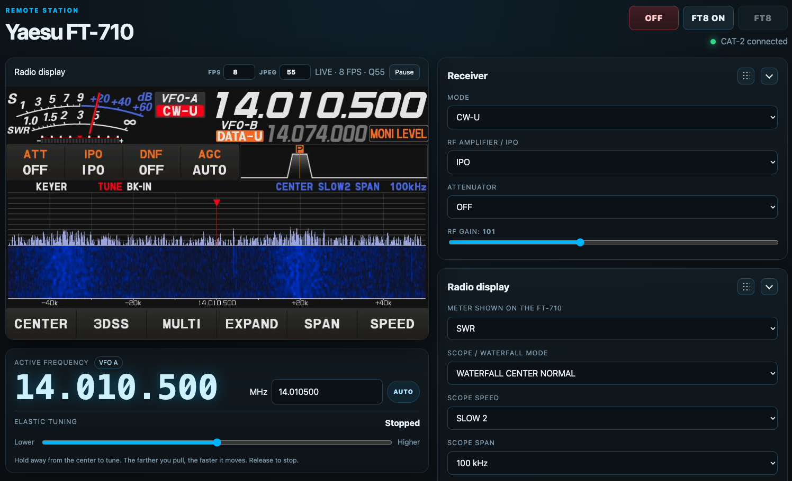
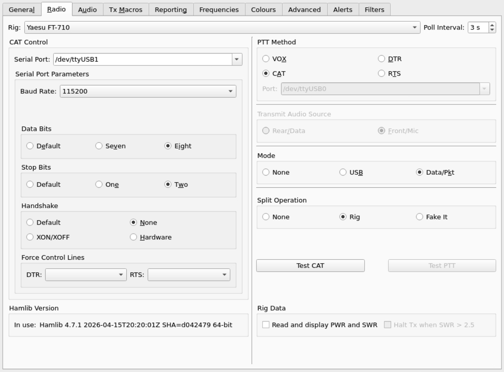
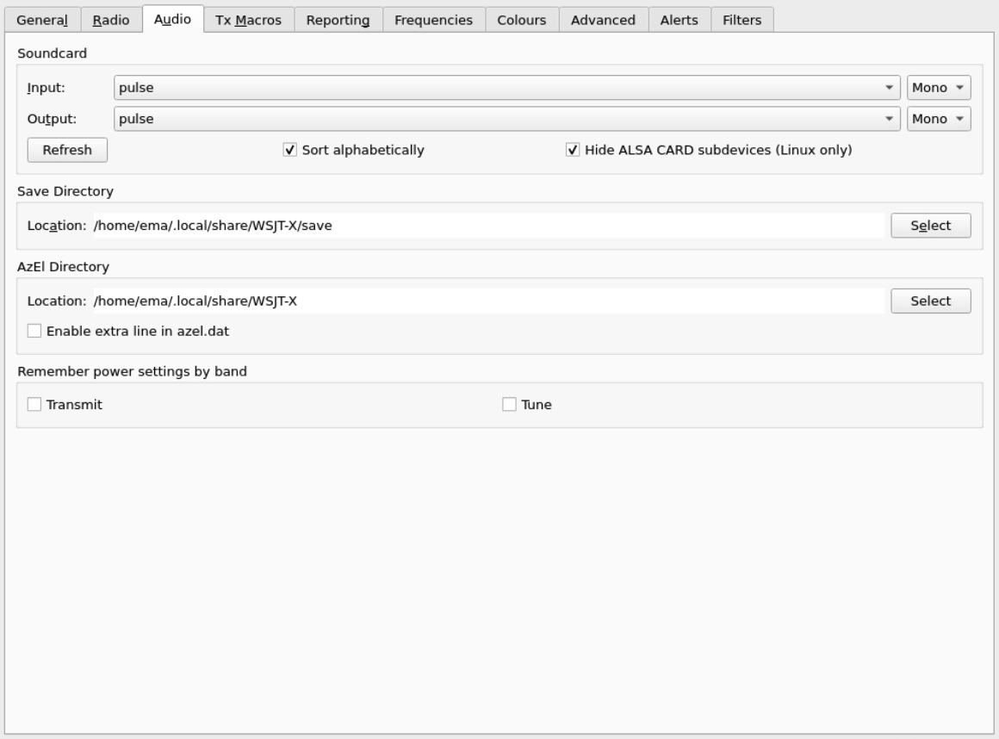
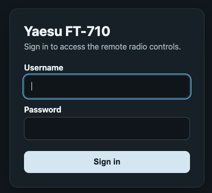
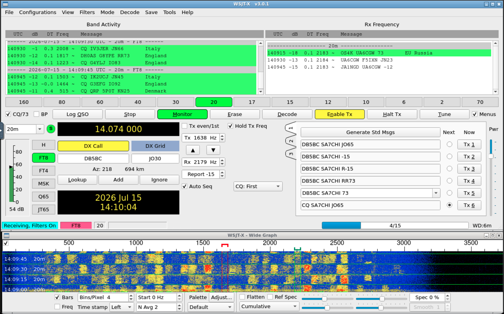
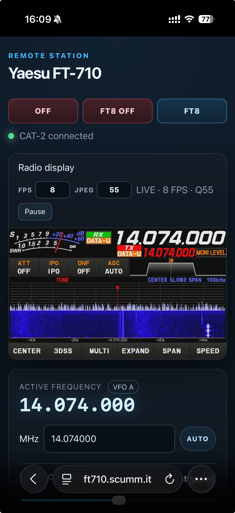

# FreeRig710

FreeRig710 is a self-hosted web remote-control stack for the **Yaesu FT-710**.
It combines direct CAT control, live capture of the radio display, bidirectional
browser audio, CW/SSTV tools, memories and a remotely accessible WSJT-X desktop.

The project was developed on a **Raspberry Pi 4 Model B** connected to the
FT-710 with a USB-A to USB-B “printer cable” and a **GeeekPi HDMI-to-CSI2**
capture board. An Apache server provides HTTPS, form-based authentication,
encrypted session cookies and reverse proxies for the API and noVNC.

> [!WARNING]
> This software can control and transmit through a real radio. Read
> [SECURITY.md](SECURITY.md), test with a dummy load or low power, and never
> expose the Raspberry Pi API or noVNC ports directly to the Internet.

FreeRig710 is not affiliated with or endorsed by Yaesu. “Yaesu” and “FT-710”
are used only to identify the supported transceiver.



## Features

- Direct CAT-2 control through `/dev/ttyFT710_AUX`.
- Independent WSJT-X CAT-1 connection through `/dev/ttyFT710_CAT`.
- No `rigctld` dependency.
- Live 800 × 480 MJPEG view of the FT-710 external display.
- Click tuning, VFO A/B controls, mode, receiver DSP, scope, tuner and power.
- Browser receive audio and microphone audio over a secure WebSocket.
- Press-and-hold CAT PTT with watchdog and disconnect safety handling.
- Radio memory synchronization and local metadata.
- CW decoder/keyer and browser SSTV decoder.
- WSJT-X desktop started on demand through TigerVNC + noVNC.
- Responsive desktop and mobile web interface.
- Apache form login using an encrypted session cookie.

## Critical serial-port ownership

Do not interchange these two ports:

```text
/dev/ttyFT710_CAT  → CAT-1 / Enhanced COM → WSJT-X directly
/dev/ttyFT710_AUX  → CAT-2 / Standard COM → FreeRig710 FastAPI directly
```

Both radio CAT rates are set to **115200 baud**. WSJT-X uses CAT-1 with 8 data
bits, two stop bits and no handshake. The API uses CAT-2 with 8 data bits, one
stop bit, no parity and no flow control.

## Architecture

```text
                           PUBLIC HTTPS
Browser ───────────────────────┐
                               ▼
                      Apache web server
                form login + encrypted cookie
                 │             │             │
                 │ /           │ /ft710-api/ │ /ft8/
                 ▼             ▼             ▼
              frontend      FastAPI       noVNC proxy
                                │             │
                                │             └── websockify :10005
                                │                    └── TigerVNC :105 / :6005
                                │                           └── WSJT-X
                                │
             ┌──────────────────┼────────────────────┐
             ▼                  ▼                    ▼
      CAT-2 / AUX         TC358743 video       PipeWire audio
 /dev/ttyFT710_AUX         /dev/video0       source/sink endpoints

WSJT-X ─────────────── CAT-1 / Enhanced COM ───────── /dev/ttyFT710_CAT
```

See [docs/ARCHITECTURE.md](docs/ARCHITECTURE.md) for component-level details.

## Hardware

Required station hardware:

- Yaesu FT-710.
- Raspberry Pi 4 Model B, reliable PSU and storage.
- USB-A male to USB-B male cable, commonly called a USB printer cable.
- GeeekPi HDMI-to-CSI2 board based on the TC358743.
- CSI ribbon cable suitable for the Raspberry Pi 4.
- DVI-to-HDMI adapter for the FT-710 `EXT-DISPLAY` connector.
- HDMI-to-HDMI cable from the adapter to the GeeekPi board.
- Network connection, antenna/dummy load and suitable radio power supply.
- Optional separate Debian/Apache webserver for public HTTPS access.

The video path is:

```text
FT-710 DVI-D → DVI-to-HDMI adapter → HDMI cable
             → GeeekPi HDMI-to-CSI2 → CSI ribbon → Raspberry Pi 4
```

Full details are in [docs/HARDWARE.md](docs/HARDWARE.md).

## Tested software baseline

### Raspberry Pi

- Debian GNU/Linux 13.6 “Trixie”, aarch64.
- Raspberry Pi kernel 6.18.34+rpt-rpi-v8.
- Python 3.13.5.
- FastAPI 0.137.2.
- Uvicorn 0.49.0.
- Pydantic 2.13.4.
- pySerial 3.5.
- v4l-utils 1.30.1.
- GStreamer 1.26.x packages.
- PipeWire / pipewire-pulse 1.4.2.
- TigerVNC 1.15.0.
- noVNC 1.6.0.
- websockify 0.12.0.
- WSJT-X 3.0.1.
- Openbox 3.6.1.

### Apache server

- Debian GNU/Linux 12 “Bookworm”.
- Apache 2.4.67.
- Required modules: `auth_form`, `authn_file`, `headers`, `proxy`,
  `proxy_http`, `proxy_wstunnel`, `rewrite`, `session`, `session_cookie`,
  `session_crypto` and `ssl`.

Other recent Debian/Raspberry Pi OS versions may work, but this is the tested
reference environment.

## Repository layout

```text
FreeRig710/
├── api/                       FastAPI application and Python dependencies
├── frontend/                  static HTML, JavaScript and CSS
├── config/
│   ├── apache/                installable Apache virtual-host template
│   ├── boot/                  Raspberry Pi boot overlay snippet
│   ├── environment/           non-secret API environment example
│   ├── systemd/               API, audio and EDID service templates
│   ├── tigervnc/              WSJT-X xstartup template
│   ├── udev/                  stable FT-710 device-name template
│   └── video/                 tc358743-edid.hex
├── docs/                      architecture, hardware and troubleshooting
├── scripts/                   installation, update and validation helpers
├── LICENSE                    MIT license
└── SECURITY.md                deployment and secret-handling rules
```

Runtime databases, logs, PID files, secrets, TLS material and local virtual
environments are excluded by `.gitignore`.

# Installation

The reference design uses two hosts:

```text
Raspberry Pi: private address, for example 192.168.1.20
Apache server: private address, for example 192.168.1.10
Public domain: for example radio.example.com
```

Replace all example values with your own network information.

## 1. Configure the FT-710

Before installing software, configure the radio.

Press **FUNC**, then set:

```text
DISPLAY SETTING → EXT MONITOR
  EXT DISPLAY = ON
  PIXEL       = 800x480

OPERATION SETTING → GENERAL
  CAT-1 RATE             = 115200 bps
  CAT-1 CAT-3 STOP BIT   = 2bit
  CAT-2 RATE             = 115200 bps
```

Check the active FT8 preset too: it can store and override CAT-1 rate and stop
bits. Details are in [docs/RADIO_SETUP.md](docs/RADIO_SETUP.md).

## 2. Connect the hardware

1. Power off the radio and Raspberry Pi while making connections.
2. Connect FT-710 USB-B to a Raspberry Pi USB-A port.
3. Connect the DVI-to-HDMI adapter to `EXT-DISPLAY`.
4. Connect the HDMI cable to the GeeekPi board.
5. Connect the GeeekPi board to the Raspberry Pi camera connector with the CSI
   ribbon cable, observing connector orientation.
6. Connect the Raspberry Pi to the private network.
7. Power on and verify that the radio external-display output is active.

## 3. Prepare the Raspberry Pi

Clone the repository directly into the recommended installation path:

```bash
sudo install -d -o "$USER" -g "$USER" /opt/freerig710
git clone https://YOUR-GIT-HOST/YOUR-ACCOUNT/freerig710.git /opt/freerig710
cd /opt/freerig710
```

For an extracted ZIP, copy the `FreeRig710` directory to `/opt/freerig710`.

### Find the radio USB serial

With the USB cable connected, inspect both CP2105 serial interfaces:

```bash
for device in /dev/ttyUSB*; do
  echo "=== $device ==="
  udevadm info -q property -n "$device" \
    | grep -E 'ID_VENDOR_ID|ID_MODEL_ID|ID_SERIAL_SHORT|ID_USB_INTERFACE_NUM'
done
```

The expected USB vendor/product is `10c4:ea70`. Record
`ID_SERIAL_SHORT`; it is required by the udev template.

### Find the audio USB topology

The serial number is enough for CAT symlinks. The tested installation also
uses a topology-specific udev rule to name the USB audio card `FT710`.
Identify the radio sound card with:

```bash
aplay -l
udevadm info -q path -n /dev/snd/controlC0
udevadm info -q path -n /dev/snd/controlC1
udevadm info -q path -n /dev/snd/controlC2
```

Select the path belonging to the FT-710. Convert it to the wildcard form used
by `DEVPATH`, for example:

```text
*/usb1/1-1/1-1.3/1-1.3.2/*
```

The exact path depends on the Raspberry Pi USB port and any hub. It will change
if the cable is moved.

## 4. Run the Raspberry installer

Example:

```bash
cd /opt/freerig710
sudo ./scripts/install-raspberry.sh \
  --user "$USER" \
  --domain radio.example.com \
  --raspberry-ip 192.168.1.20 \
  --webserver-ip 192.168.1.10 \
  --radio-serial YOUR_RADIO_USB_SERIAL \
  --audio-devpath '*/usb1/1-1/1-1.3/1-1.3.2/*'
```

The script:

- installs the tested Debian packages;
- creates `api/.venv` and installs pinned Python requirements;
- creates `/etc/ft710-api.env` from the non-secret example;
- installs stable CAT udev rules;
- adds `dtoverlay=tc358743` to the Raspberry Pi boot configuration;
- installs the bundled `tc358743-edid.hex` and EDID systemd service;
- installs the API system service;
- installs the per-user audio watcher;
- installs the TigerVNC `xstartup` file;
- enables user lingering for PipeWire and WSJT-X operation.

Review `/etc/ft710-api.env` after installation. In particular, confirm the
user UID paths, public origin, Raspberry Pi bind address and Apache proxy IP.

Then reboot:

```bash
sudo reboot
```

## 5. Verify the Raspberry devices

After reboot:

```bash
ls -l /dev/ttyFT710_CAT /dev/ttyFT710_AUX /dev/video0
media-ctl -p
v4l2-ctl -d /dev/video0 --query-dv-timings
```

Expected media topology:

```text
tc358743 10-000f → unicam-image → /dev/video0
```

Expected signal:

```text
800x480p60
UYVY
```

Start the EDID and API services:

```bash
sudo systemctl start tc358743-edid.service
sudo systemctl start ft710-api.service
sudo systemctl status tc358743-edid.service ft710-api.service --no-pager -l
```

Run the included validation helper:

```bash
sudo -u "$USER" ./scripts/validate-installation.sh
```

The EDID service retries for up to 30 seconds while `/dev/video0` appears. The
bundled file is at `config/video/tc358743-edid.hex`.

## 6. Verify and start audio

Check that the USB audio card is named `FT710`:

```bash
aplay -l
```

Start the user audio watcher. Replace `1000` with your user UID when needed:

```bash
uid="$(id -u)"
systemctl --user daemon-reload
systemctl --user enable --now ft710-audio-watch.service
systemctl --user status ft710-audio-watch.service --no-pager -l

pactl list short sinks | grep ft710
pactl list short sources | grep ft710
```

Expected endpoints:

```text
ft710_out_44100
ft710_in_44100
```

The setup script does not delete or replace `~/.asoundrc`.

## 7. Configure WSJT-X

Start FT8 from the web API later, or temporarily start TigerVNC manually for
configuration. In **WSJT-X → File → Settings → Radio**, use:

```text
Rig:          Yaesu FT-710
Serial Port:  /dev/ttyFT710_CAT
Baud Rate:    115200
Data Bits:    Eight
Stop Bits:    Two
Handshake:    None
PTT Method:   CAT
Mode:         Data/Pkt
Split:        Rig
```

In **File → Settings → Audio**, set:

```text
Input:   pulse
Output:  pulse
Channels: Mono
```





WSJT-X must not use `/dev/ttyFT710_AUX`.

## 8. Prepare the Apache server

On the Apache host, clone or extract the same repository:

```bash
git clone https://YOUR-GIT-HOST/YOUR-ACCOUNT/freerig710.git
cd freerig710
```

Install the initial webserver packages and obtain a certificate:

```bash
sudo apt update
sudo apt install -y apache2 certbot python3-certbot-apache
sudo certbot certonly --apache -d radio.example.com
```

DNS must already point the public domain to the Apache server, and TCP ports
80/443 must reach it during certificate issuance.

Now install the frontend, login files and virtual host:

```bash
sudo ./scripts/install-webserver.sh \
  --domain radio.example.com \
  --raspberry-ip 192.168.1.20 \
  --username your-login-name \
  --admin-email you@example.com
```

The script interactively creates the password file. It also generates a local
random Apache session-encryption key. Neither file belongs in Git.

The installed paths are:

```text
/var/www/ft710/
/etc/apache2/sites-available/freerig710.conf
/etc/apache2/freerig710.htpasswd
/etc/apache2/freerig710-session.key
```

Validate Apache:

```bash
sudo apache2ctl configtest
sudo systemctl reload apache2
```

Open:

```text
https://radio.example.com/
```



## 9. Restrict the Raspberry Pi network ports

TCP 8100 and 10005 are private backend ports. Permit access only from the
Apache server. A generic `ufw` example is:

```bash
sudo ufw allow from 192.168.1.10 to any port 8100 proto tcp
sudo ufw allow from 192.168.1.10 to any port 10005 proto tcp
sudo ufw deny 8100/tcp
sudo ufw deny 10005/tcp
```

Adapt the order and syntax to your firewall. Keep SSH access before enabling a
new firewall policy. Do not port-forward 8100 or 10005 from the Internet.

## 10. Functional checks

From the Apache server, confirm private backend reachability:

```bash
curl -s http://192.168.1.20:8100/api/v1/health | python3 -m json.tool
curl -I http://192.168.1.20:10005/vnc.html
```

From a browser:

1. Sign in.
2. Confirm the radio reports connected.
3. Confirm the live display appears.
4. Change frequency at low risk and confirm both the radio and UI update.
5. Enable receive audio and use a headset.
6. Test PTT into a dummy load or at low power.
7. Select **FT8 ON**, then open **FT8**.
8. Confirm WSJT-X uses CAT-1 while the web UI continues using CAT-2.



## Configuration files

### `/etc/ft710-api.env`

The canonical non-secret example is:

```text
config/environment/ft710-api.env.example
```

Important values:

- `FT710_CAT2_DEVICE=/dev/ttyFT710_AUX`.
- `FT710_API_HOST`: private Raspberry Pi address.
- `FT710_FORWARDED_ALLOW_IPS`: Apache private IP and localhost.
- `FT710_AUDIO_ALLOWED_ORIGIN`: exact public `https://` origin.
- `FT710_FT8_BIND_HOST`: private Raspberry Pi address.
- `FT710_FT8_USER`, home, UID runtime paths and D-Bus path.
- `FT710_MEMORIES_DB`: writable runtime location.

### Apache template

The installable template is:

```text
config/apache/freerig710.conf.template
```

It protects the frontend, REST API, WebSocket, MJPEG and noVNC paths with the
same Apache form login and encrypted session cookie.

### udev template

The CAT rules use the FT-710 CP2105 identifiers and your radio USB serial.
Audio and FT4222 rules are optional and topology-specific:

```text
config/udev/99-ft710.rules.template
```

### systemd templates

```text
config/systemd/ft710-api.service.template
config/systemd/ft710-audio-watch.service.template
config/systemd/tc358743-edid.service.template
```

## Deployment and updates

After connecting this repository to GitHub or GitLab, use a normal pull-and-
deploy workflow.

### Raspberry Pi

```bash
cd /opt/freerig710
git pull --ff-only
sudo ./scripts/update-raspberry.sh
```

This stops the API, updates backend and audio helper files, refreshes Python
dependencies and starts the service again. It does not overwrite
`/etc/ft710-api.env`, udev rules or secrets.

### Apache server

```bash
cd /path/to/freerig710
git pull --ff-only
sudo ./scripts/update-webserver.sh
```

This updates only static frontend files, validates Apache and reloads it. It
does not overwrite the virtual host, htpasswd or session key.

For configuration-template changes, review the Git diff and apply them
manually. Do not replace a working site configuration blindly.

## Git initialization

This release archive already contains a local Git repository. To inspect it:

```bash
cd FreeRig710
git status
git log --oneline --decorate -n 5
```

Connect a remote later:

```bash
git remote add origin git@github.com:YOUR-ACCOUNT/freerig710.git
git branch -M main
git push -u origin main
```

Use the equivalent URL for GitLab if preferred.

Before every commit:

```bash
git status --short
git diff --cached
```

Never commit passwords, cookie keys, TLS private keys, runtime databases or
logs.

## Screenshots

### Desktop


### Mobile



### Login


### WSJT-X over noVNC


The WSJT-X operating screenshot contains normal on-air callsigns and decoded
messages visible at capture time.

## Troubleshooting

See [docs/TROUBLESHOOTING.md](docs/TROUBLESHOOTING.md) for CAT, video, EDID,
audio, noVNC and Apache diagnostics.

Useful service logs:

```bash
sudo journalctl -u ft710-api -f
sudo journalctl -u tc358743-edid -f
journalctl --user -u ft710-audio-watch -f
sudo tail -f /var/log/apache2/freerig710-error.log
```

## License

FreeRig710 source code and original documentation are released under the [MIT License](LICENSE). The bundled PiKVM EDID data retains its upstream GPLv3 license; see [THIRD_PARTY_NOTICES.md](THIRD_PARTY_NOTICES.md).

Copyright © 2026 Emanuele Laface.
