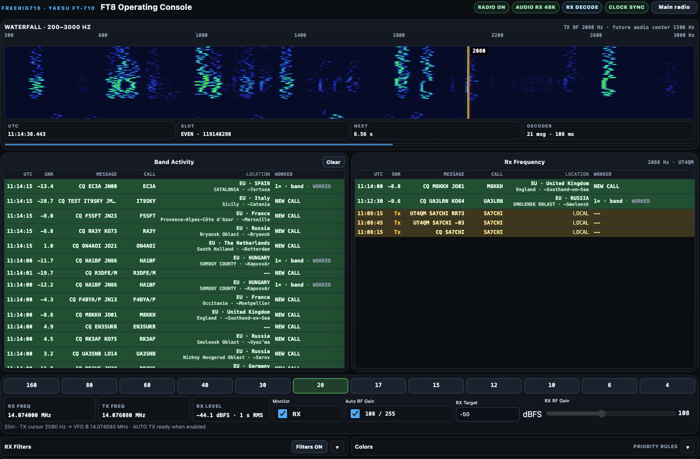
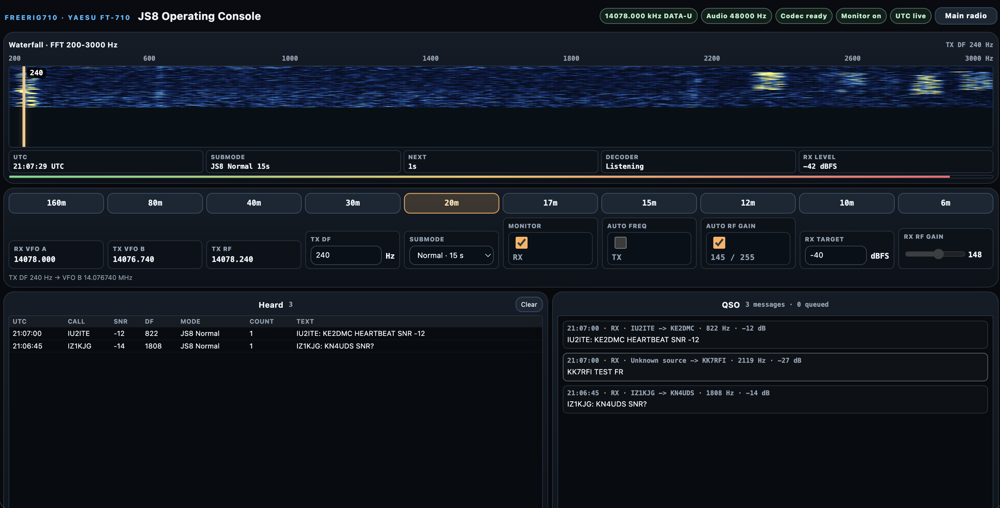
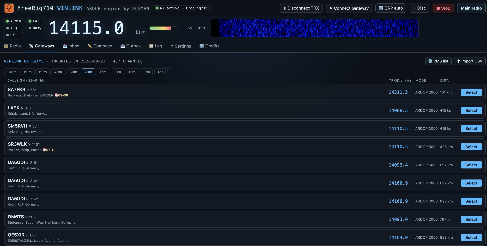

# FreeRig710

**FreeRig710** is a self-hosted remote-control, FT8, JS8 and Winlink station for the **Yaesu FT-710**, rebuilt around a **Waveshare ESP32-P4-NANO**. The ESP32-P4 talks directly to the radio over USB for CAT and audio, captures the FT-710 external display through HDMI/DVI-to-CSI-2, serves the control API over wired Ethernet, and owns the time-critical/safety-critical digital transmit path. The web frontend can be served locally for development or from Apache over HTTPS with form authentication.

> **RF safety:** this software can key a real transmitter. Start at low power or into a dummy load, verify CAT/PTT/audio behavior locally, and do not expose the ESP32 HTTP port directly to the public Internet.

FreeRig710 is not affiliated with or endorsed by Yaesu. “Yaesu” and “FT-710” identify the supported radio only.

## Screenshots

### Main radio console


### Integrated FT8 console



### Integrated JS8 console



### Browser Winlink / ARDOP console



## Hardware

The tested/reference build uses:

- **Yaesu FT-710** transceiver.
- **Waveshare ESP32-P4-NANO** development board. Purchase link supplied by the project author: [Amazon](https://amzn.eu/d/071WkV44). Official board documentation: [Waveshare ESP32-P4-NANO](https://docs.waveshare.com/ESP32-P4-NANO).
- **HDMI-to-CSI-2 adapter based on TC358743**. Purchase link supplied by the project author: [Amazon](https://amzn.eu/d/0g5nXgCs).
- DVI-D-to-HDMI adapter for the FT-710 `EXT-DISPLAY` connector.
- HDMI cable from the radio adapter to the TC358743 board.
- Compatible CSI ribbon/cable between the TC358743 board and the ESP32-P4-NANO MIPI-CSI connector.
- USB-A to USB-B cable from the ESP32-P4-NANO host port to the FT-710 USB-B port.
- Wired Ethernet connection for the ESP32-P4-NANO.
- 5 V USB-C power for the ESP32-P4-NANO and a normal, correctly rated supply for the FT-710.

The ESP32-P4-NANO used during development has **16 MB NOR flash and 32 MB PSRAM**. The firmware uses the board's wired 100 Mbps Ethernet, MIPI-CSI and USB host interfaces.

See [docs/HARDWARE.md](docs/HARDWARE.md) for the complete wiring and signal path, and [hardware/case/](hardware/case/) for the printable enclosure.

## What FreeRig710 does

- Full browser control of the FT-710: power, VFOs, frequency, modes, RX/TX routing, RF gain, preamp/IPO, attenuator, AGC, filters, DNR, noise blanker, notch/contour, scope settings, TX power and tuner.
- Live **800×480** FT-710 external display as MJPEG, with click tuning.
- Bidirectional browser audio through the FT-710 USB audio interface.
- Watchdog-protected browser PTT.
- FT-710 memory synchronization and local metadata.
- CW decoder/keyer and browser SSTV decoder.
- Integrated FT8 waterfall, decoder, band activity, QSO state machine, auto sequencing, staged 48 kHz TX, ALC tune helper and logging.
- Native browser JS8 console with JS8 encode/decode, band selection, heard list, CQ/heartbeat, directed messages and ADIF line generation, using the existing FreeRig710 CAT and audio WebSocket path.
- Browser Winlink/ARDOP client based on DL2MAN's ARDOP Winlink work, adapted to use the existing FreeRig710 CAT and browser audio/WebSocket path.
- QRZ Logbook configuration, QSO upload, full import and incremental synchronization.
- Local worked-call/DXCC/country tracking and configurable FT8 color-priority rules.
- Offline Maidenhead geography lookup for continent, country, region and representative nearby city.
- Apache2 deployment with one HTTPS form-login session protecting the frontend, API, audio WebSocket, video and digital-mode pages.

## Architecture

```text
Browser
  │ HTTPS
  ▼
Apache2 (optional but recommended for remote access)
  ├── /                  static frontend from /var/www/ft710
  ├── /api/*             reverse proxy ─────────────┐
  ├── /api/v1/audio/ws   WebSocket reverse proxy ──┤
  └── /video.mjpeg       MJPEG reverse proxy ──────┤
                                                   ▼
                                            ESP32-P4-NANO
                                              │       │
                          FT-710 USB-B ◄───────┘       └──── wired Ethernet
                         CAT-2 + UAC1 audio

FT-710 EXT-DISPLAY (DVI-D)
  → DVI/HDMI adapter
  → HDMI cable
  → TC358743 HDMI-to-CSI-2
  → ESP32-P4-NANO MIPI-CSI
```

The firmware obtains an address by DHCP and advertises `ft710.local` through mDNS. The ESP32 HTTP/API service listens on port 80. FT8 transmit also requires a valid UTC clock; the firmware starts SNTP against `pool.ntp.org` after DHCP.

## Repository layout

```text
FreeRig710/
├── components/              ESP-IDF components: CAT, USB, audio, video, API, config
├── main/                    ESP32-P4 application entry point
├── frontend/                static main, FT8, JS8 and Winlink web interfaces
├── deploy/apache/           authenticated Apache2 reverse-proxy templates
├── docs/                    installation, hardware, radio, QRZ and UI documentation
├── hardware/case/           top.stl and bottom.stl enclosure files
├── tests/                   regression/static contract tests from the FT8.6.5.22 lineage
├── tools/                   diagnostics and geography database generator
├── CMakeLists.txt
├── sdkconfig.defaults
├── partitions.csv
├── VERSION                  FreeRig710 release number
├── LICENSE                  MIT license for FreeRig710 source
└── THIRD_PARTY_NOTICES.md   runtime/data dependency notices
```

Release **1.0** is based on the validated **FT8.6.5.22** engineering baseline. Historical version numbers remain in some source comments and regression-test filenames because they document the fixes those tests protect.

## Build and flash the ESP32-P4

The validated development baseline is **ESP-IDF 6.0.2** with target `esp32p4`.

```bash
cd FreeRig710
. "$IDF_PATH/export.sh"
idf.py fullclean
idf.py build
idf.py -p /dev/ttyUSB0 flash monitor
```

Replace `/dev/ttyUSB0` with the programming port on your system. The root project already selects `esp32p4`; `sdkconfig.defaults` enables the 16 MB flash, external PSRAM, USB host support, WebSocket support, certificate bundle and the custom partition table used by this build.

After boot, check the serial monitor for:

- Ethernet DHCP address;
- `ft710.local` mDNS registration;
- TC358743 discovery and stable 800×480 source;
- FT-710 USB enumeration;
- CAT-2 at 115200 baud;
- C-Media UAC1 RX/TX audio;
- SNTP synchronization.

If the FT-710 USB devices do not enumerate after a cold boot, unplug/replug the radio USB cable once after the ESP32 has initialized its USB host.

Detailed instructions: [docs/INSTALLATION.md](docs/INSTALLATION.md).

## Configure the FT-710

At minimum:

1. Enable the FT-710 external display.
2. Set the external-display pixel mode to **800×480**.
3. Set **CAT-2 / Standard COM** to **115200 baud**.
4. Connect the FT-710 USB-B port to the ESP32-P4-NANO USB-A host port.
5. Use the FT8 page to select an FT8 band; FreeRig710 then configures the operating VFOs for `DATA-U`, RX on VFO A and split TX on VFO B.

The FT8 page also disables the digital filters used by the normal voice UI and selects a 3.2 kHz receive width for FT8 operation. See [docs/RADIO_SETUP.md](docs/RADIO_SETUP.md).

## Frontend deployment

For local development you can serve `frontend/` and let the GUI use `http://ft710.local` as its backend. For normal remote operation, serve the frontend from Apache and proxy the ESP32 on the same HTTPS origin.

Copy the frontend:

```bash
sudo install -d -o www-data -g www-data /var/www/ft710
sudo rsync -a --delete frontend/ /var/www/ft710/
```

Then use the template in [deploy/apache/ft710-ssl.conf.example](deploy/apache/ft710-ssl.conf.example). The current frontend expects same-origin paths such as `/api/v1/...`, `/api/v1/audio/ws` and `/video.mjpeg`; `js8.html` and `winlink.html` use the same API and audio WebSocket origin. It does **not** need the old Raspberry Pi `/ft710-api/` or noVNC `/ft8/` proxies.

Complete authenticated Apache setup: [docs/APACHE.md](docs/APACHE.md).

## QRZ Logbook setup

QRZ credentials are configured from the **QRZ Log** panel in the main interface:

1. Open your QRZ Logbook API page and copy the API key for the correct logbook/callsign: <https://www.qrz.com/docs/logbook30/api>.
2. In FreeRig710, enter **My callsign**.
3. Paste the **QRZ Logbook API key**.
4. Press **SAVE QRZ CONFIG**.

The callsign and key are stored in ESP32 NVS. The key is not returned to the browser by the status API. QRZ documents the key as full read/write access to the selected logbook, so treat it like a password.

On the FT8 page, run **QRZ Import** once to populate the browser's local worked-QSO database, then use **QRZ Sync** for incremental updates. The worked database is stored in the browser (IndexedDB), so another browser/profile needs its own import/sync.

See [docs/QRZ_LOGBOOK.md](docs/QRZ_LOGBOOK.md).

## Main interface

The main console provides the live radio display and the normal station controls. Panels can be reordered with the drag handle and collapsed; the browser remembers layout and UI preferences locally.

Key areas are:

- **Radio display** — live 800×480 capture, FPS/JPEG controls and click-to-tune.
- **Active frequency / elastic tuning** — direct frequency entry and continuous tuning control.
- **VFO control** — VFO A/B, split routing, copy/swap.
- **Receiver / Filter / Noise reduction / Radio display** — normal FT-710 receive and scope controls.
- **Audio and PTT** — browser receive audio, microphone gain and latching PTT with watchdog protection.
- **Memories** — synchronize real FT-710 memories and keep category/note metadata in ESP32 NVS.
- **CW / SSTV** — browser-side digital tools using the shared RX audio stream.
- **Transmitter and tuner** — TX power and tuner controls.
- **QRZ Log** — station/API-key setup and manual QSO submission.
- **Radio status / advanced CAT** — diagnostics and restricted raw CAT access.

More detail: [docs/MAIN_INTERFACE.md](docs/MAIN_INTERFACE.md).

## FT8 interface

The integrated FT8 console is not a remote WSJT-X desktop. Decoding and QSO orchestration run in the browser while the ESP32 owns radio state validation, UTC/PTT timing and staged USB-audio transmission.

Important controls:

- **Waterfall 200–3000 Hz** — click to choose TX audio DF.
- **Band Activity** — decoded traffic with SNR, message, callsign, offline location and worked status. Clicking any valid decoded message selects that CALL and starts a QSO attempt; it is not limited to `CQ` rows.
- **Rx Frequency** — messages associated with the selected station/frequency.
- **Band buttons** — standard FT8 dial frequencies for 160 m through 4 m (60 m/4 m are marked regional).
- **Monitor / Auto RF Gain / RX Target** — receive control and automatic RF-gain loop.
- **RX Filters** — configurable decode filtering.
- **Colors** — priority rules, including new DXCC, new country, new call and ordinary CQ/worked states.
- **QSO** — `Enable CQ`, message sequence, `Enable TX`, `Halt TX`, Tune ALC, Auto Seq, Call 1st, Hold TX frequency and timeout/retry controls.
- **Log QSO** — local ADIF/IndexedDB log, QRZ full import/sync and QRZ upload after a completed contact.

FreeRig710 keeps a compact offline Maidenhead-4 geographic index. A decoded grid can therefore show continent, country, region and a representative nearby city without a network lookup. The city is approximate and is displayed with `~` where appropriate.

Detailed FT8 operation: [docs/FT8.md](docs/FT8.md).

## JS8 interface

The **JS8** button opens `frontend/js8.html`, a native browser JS8 operating console for keyboard-to-keyboard weak-signal operation. It uses vendored JS8 WASM assets from `wfweb`, based on JS8Call-improved, while FreeRig710 continues to provide CAT, DATA-U setup, split VFO handling, PTT and 48 kHz audio transport through its existing FT-710 API and audio WebSocket.

The page provides:

- Standard JS8 band buttons with automatic radio setup and split TX/RX handling.
- Selectable JS8 submodes for Slow, Normal, Fast, JS8 40 and JS8 60 operation.
- FFT waterfall over the JS8 audio passband, with click-to-set TX audio frequency.
- Browser-side monitor/decode, heard-station table and scrollable QSO view.
- CQ, heartbeat and directed-message transmit controls using the existing FreeRig710 audio path.
- Automatic RF gain mode matching the FT8 page, plus manual RF-gain control.
- QRZ Logbook submission for JS8 contacts as ADIF `MFSK` with `SUBMODE=JS8`.

Upstream references:

- wfweb: <https://github.com/adecarolis/wfweb>
- JS8Call-improved: <https://github.com/JS8Call-improved/JS8Call-improved>

See [THIRD_PARTY_NOTICES.md](THIRD_PARTY_NOTICES.md) for GPL-3.0 license and attribution notes for the vendored JS8 codec assets.

## Winlink / ARDOP interface

The **Winlink** button opens `frontend/winlink.html`, a browser Winlink/ARDOP client integrated with FreeRig710. The modem/client code is based on DL2MAN's ARDOP Winlink project and keeps DL2MAN's ARDOP/B2F implementation in the browser while routing CAT and audio through FreeRig710's existing FT-710 API and audio WebSocket.

Upstream references:

- DL2MAN ARDOP project: <https://dl2man.de/ARDOP/>
- DL2MAN browser client: <https://dl2man.de/ARDOP/client/>

See [THIRD_PARTY_NOTICES.md](THIRD_PARTY_NOTICES.md) for license and attribution notes.

## 3D-printable case

The enclosure files are in [hardware/case/](hardware/case/):

- `top.stl` — approximately 55 × 55 × 26.1 mm bounding size.
- `bottom.stl` — approximately 55 × 55 × 5.6 mm bounding size.

Both meshes are watertight in the supplied files. See [hardware/case/README.md](hardware/case/README.md) for print notes.

## Licensing and third-party components

FreeRig710 source code is released under the **MIT License**; see [LICENSE](LICENSE).

The FT8 browser path, JS8 page and Winlink/ARDOP page also use external components and data with their own licenses, notably `ft8js`/`ft8_lib`, `@e04/ft8ts`, GeoNames data, the vendored GPL-3.0 JS8 codec assets from `wfweb`/JS8Call-improved and DL2MAN's ARDOP Winlink client work. They are documented in [THIRD_PARTY_NOTICES.md](THIRD_PARTY_NOTICES.md). The external FT8 JS/WASM modules are currently loaded at runtime from jsDelivr, so a completely air-gapped FT8 deployment requires vendoring those reviewed assets separately.

## Replacing the old Raspberry Pi repository

This tree is intended to replace the old Raspberry Pi implementation entirely. See [docs/REPOSITORY_REPLACEMENT.md](docs/REPOSITORY_REPLACEMENT.md) for a safe `git rm`/`rsync` workflow that keeps the existing GitHub repository history while replacing its contents with FreeRig710.
