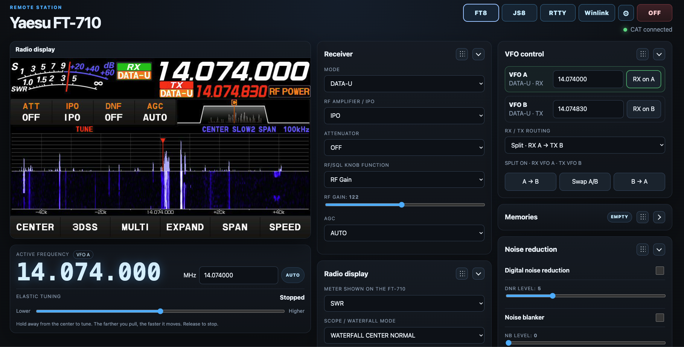

# Main radio interface

The main page is the general FT-710 remote-control console.

## Header

The header shows the station identity, digital-mode launch buttons, the shared Settings button, radio power control and CAT connectivity. **FT8**, **JS8** and **Winlink** open their dedicated operating consoles.

## Radio display

The top-left display is a live MJPEG capture of the FT-710 external display. The controls above it adjust client-side stream FPS/JPEG quality and can pause/resume the stream.

Click tuning is calibrated against the native 800×480 display geometry in `frontend/config.js`. Clicking the visible spectrum changes the radio frequency relative to the display scale.

## Active frequency and elastic tuning

The large frequency readout reflects the active VFO. Direct MHz entry tunes to an exact frequency. Elastic tuning behaves like a spring-loaded control: move away from center to tune continuously, farther for faster movement, and release to stop.

## Reorderable control panels

Most right/secondary panels can be:

- dragged by the dotted handle to reorder them;
- collapsed with the chevron.

Panel order and collapsed state are saved in browser `localStorage`.

## VFO control

Controls VFO A/B selection, frequencies, RX/TX split routing, and A↔B copy/swap operations.

## Receiver

Controls mode, IPO/preamp, attenuator, RF/SQL knob function, RF gain/squelch and AGC.

## Filter and noise reduction

Controls receive width/shift plus DNR, noise blanker, manual notch, contour and auto-notch features exposed by the CAT API.

## Radio display settings

Controls the meter shown on the physical FT-710 and scope/waterfall mode, speed and span.

## Audio and PTT

**Enable audio** opens the shared `/api/v1/audio/ws` WebSocket and plays FT-710 USB audio in the browser. The microphone path sends browser PCM back over the same WebSocket.

PTT is latching and guarded by an ESP32-side watchdog. Raw CAT TX/PTT commands are intentionally restricted from the advanced CAT box so normal users cannot bypass the safer PTT path.

## Memories

Synchronizes real FT-710 memory channels. Name/frequency/mode live in the radio; FreeRig710 also stores category/note metadata in ESP32 NVS.

## CW and SSTV

CW decoder/keyer and SSTV decoder share the normal browser receive-audio path. They do not require a second USB audio consumer.

## Transmitter and tuner

Controls TX power, tuner enable/disable and tune.

## Settings And QRZ Log

The Settings dialog stores the shared station callsign, grid, QRZ Logbook API key and ESP32 backend used by the main page, FT8, JS8 and Winlink. The QRZ Log panel provides manual QSO submission from the current radio context. See `QRZ_LOGBOOK.md`.

## Radio status and backend

The status panel exposes current hardware/API state. When the page is served from localhost, the backend URL is managed from Settings; when served from the normal HTTPS reverse proxy, same-origin paths are used automatically.
